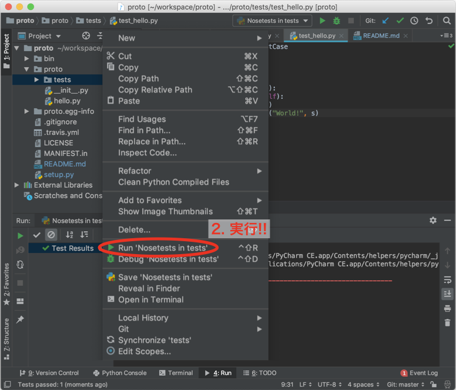

[](https://travis-ci.org/dskkato/proto)

# proto

## clone this repository

```
git clone https://github.com/dskkato/proto.git
```

## install

```
cd proto
python setyp.py install
```

## run unittest (from command line)

```
$ python setup.py test
running test
running egg_info
creating proto.egg-info
writing proto.egg-info/PKG-INFO
writing dependency_links to proto.egg-info/dependency_links.txt
writing top-level names to proto.egg-info/top_level.txt
writing manifest file 'proto.egg-info/SOURCES.txt'
reading manifest file 'proto.egg-info/SOURCES.txt'
reading manifest template 'MANIFEST.in'
writing manifest file 'proto.egg-info/SOURCES.txt'
running build_ext
test_is_hello (proto.tests.test_hello.TestHello) ... ok

----------------------------------------------------------------------
Ran 1 test in 0.009s

OK
```

## run unittest (with PyCharm)

`self.assertEqual("World!", s)`の`"World!"`を別の文字列に置き換えてみて、何が起こるか試してみてください。


